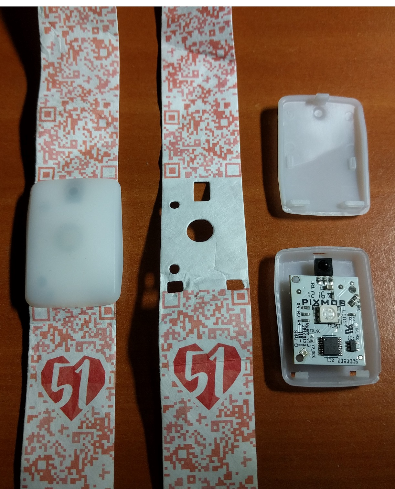
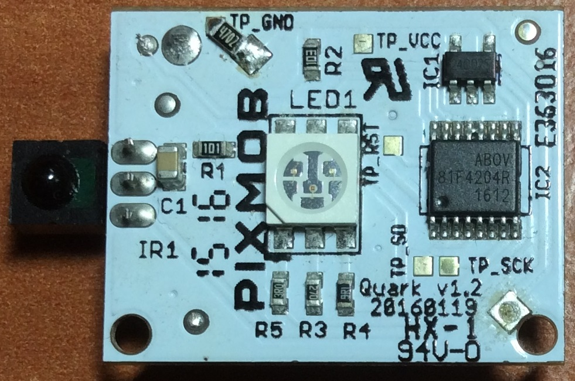
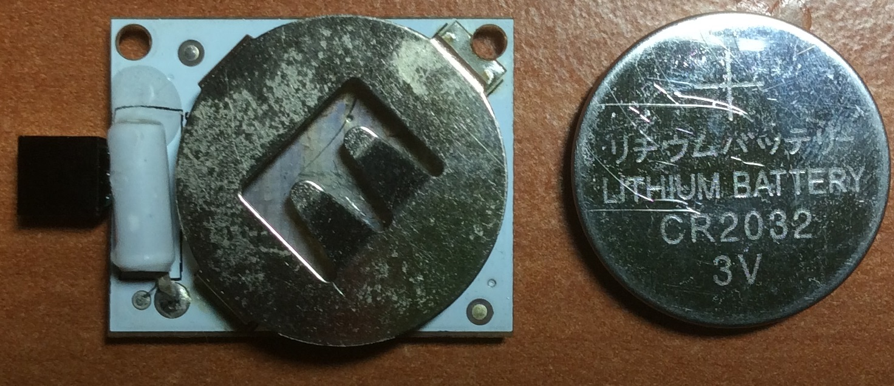
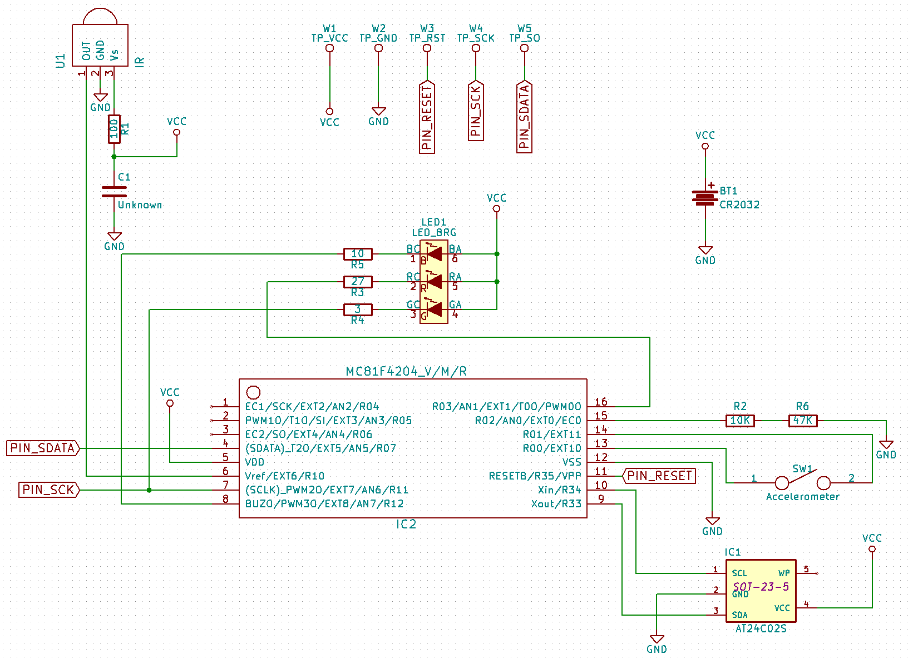
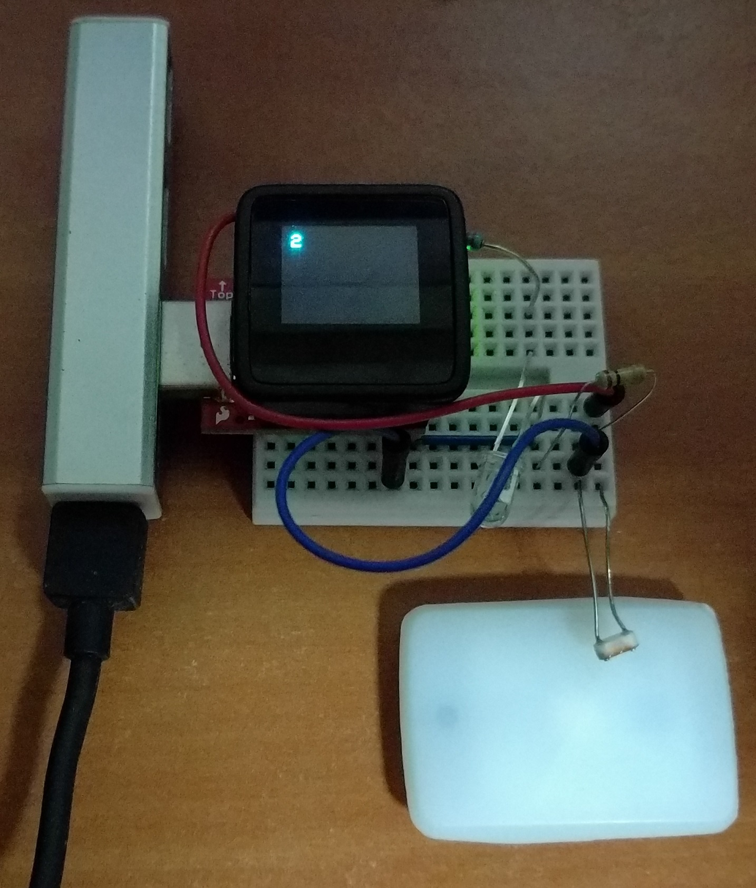
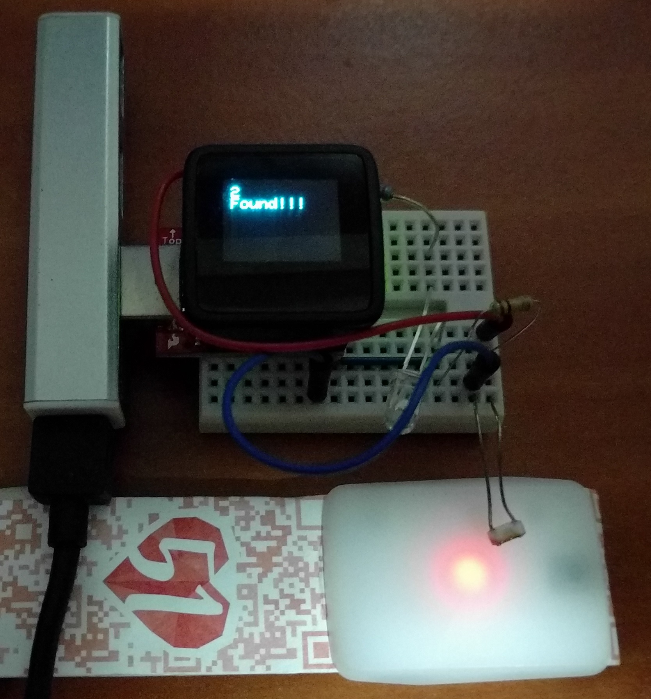
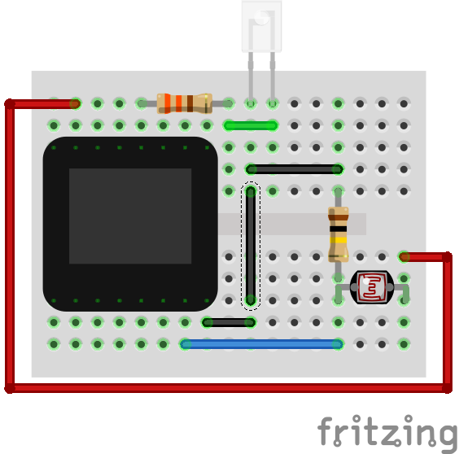

# reverse-engineering-ndp2016-wristband
Schematics of the reverse engineered Pixmob wristband used in NDP2016. Sample IR brute-force code is available but has not been fully tested in practice.

##Background

The Singapore National Day Parade (NDP2016) happened on 9 August 2016 to celebrate its 51st birthday. For those who had the opportunity to attend the actual parade or its previews/rehearsals, they will also get to receive a funpack which one of the items will be a wearable LED band made by the company called [Pixmob](http://pixmob.com/). 

This band receives infrared signals from the organisers and then displays the LED colour of their choosing. There is an onboard accelerometer. After the event when the IR signals disappear, the (single-axis I believe) accelerometer will cause the Red LED to light up when a shock is detected.

##Teardown

The wristband with the NDP51 logo

Closeup shot of the front of the PCB

Closeup shot of the back of the PCB

##Reverse Engineered Schematic

This schematic files are in Kicad format and can be found in the [ndp2016-pixmob-wristband-reverse-schematic](ndp2016-pixmob-wristband-reverse-schematic) directory.

##Brute forcing IR code combinations (unsuccessful)

I tried to brute-force the IR-code combinations but ultimately found this method infeasible due to the numerous possible combinations. For completeness I have included my brute-forcing hardware and the Arduino code in the [ir-brute-force](ir-brute-force) directory. 

The hardware runs on a Arduino-compatible Microview (based on ATmega328P with onboard OLED screen) with an IR emitter LED to brute-force the IR codes and a photocell to detect when the IR code has successfully triggered the LED. I did not complete the process as it takes too long for the Arduino to scan transmit all the codes.

Finding in progress.

Assuming the LED lights up, the Microview OLED screen will display "Found" and the search will cease. The full IR code combination will then be displayed via the UART/Serial Adapter.

Components used in brute force setup are  
1. Microview
2. Microview Programmer
3. IR LED
4. 330ohm resistor for IR LED
5. Photocell
6. 100K ohm resistor for photocell

##References:
1. [MC81F4204 datasheet](http://abov.co.kr/data/manual/MC81F4204_v1.39.pdf)
2. [AT24CS02 datasheet](http://www.atmel.com/Images/Atmel-8815-SEEPROM-AT24CS01-02-Datasheet.pdf)
